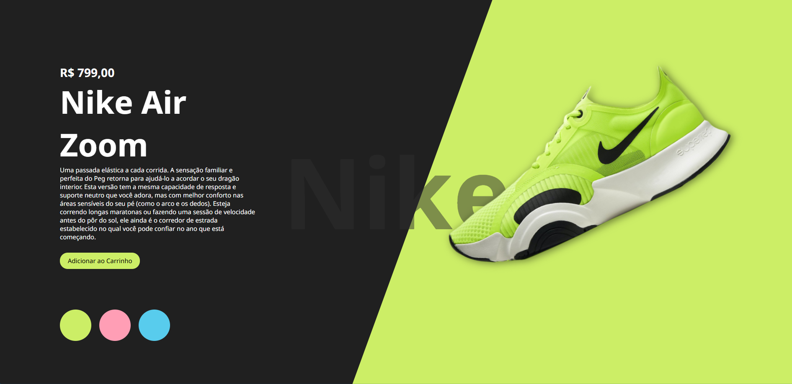

# 🏃‍♀️ Nike - Landing Page

Este é um projeto de uma landing page inspirada na Nike, desenvolvido como parte do meu processo de transição de carreira para a área de tecnologia. A página apresenta um modelo de tênis com visual dinâmico e interação por meio de JavaScript.

## 🚀 Tecnologias utilizadas

- HTML5
- CSS3
- JavaScript

## 📷 Preview

## 💡 Funcionalidades

- Layout responsivo e moderno.
- Troca de cores do produto ao clicar nos botões coloridos.
- Fontes personalizadas do Google Fonts.

